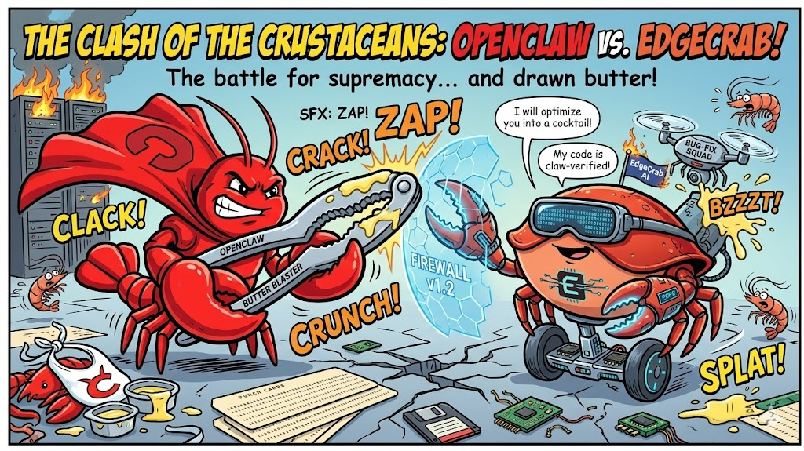
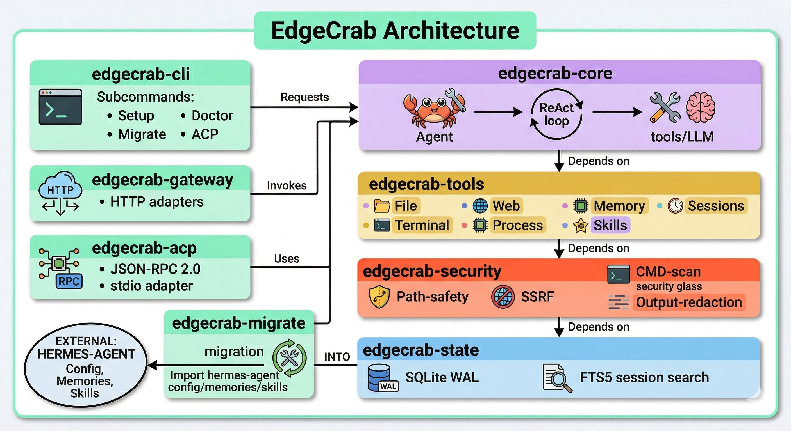

# EdgeCrab 🦀

**A Super Powerful Personal Assistant** inspired by **NousHermes** and **OpenClaw** — Rust-native, blazing-fast terminal UI, ReAct tool loop, multi-provider LLM support, ACP protocol, gateway adapters, and built-in security hardening. Install via npm, pip, or cargo. Zero runtime dependencies, single static binary.

> EdgeCrab combines the deep reasoning of NousHermes with the tool-use power of OpenClaw,
> packaged as a 15 MB native binary that starts in < 50 ms with no external dependencies.

[](LICENSE)
[](https://www.rust-lang.org/)
[](https://crates.io/crates/edgecrab-cli)
[](https://pypi.org/project/edgecrab-cli/)
[](https://www.npmjs.com/package/edgecrab-cli)
[](https://github.com/raphaelmansuy/edgecrab/actions/workflows/ci.yml)
[](https://www.edgecrab.com)




## Architecture



---

## Table of Contents

- [EdgeCrab 🦀](#edgecrab-)
  - [Architecture](#architecture)
  - [Table of Contents](#table-of-contents)
  - [Release Channels](#release-channels)
  - [Why EdgeCrab?](#why-edgecrab)
  - [Quick Start (90 seconds)](#quick-start-90-seconds)
    - [Option A — npm (no Rust required)](#option-a--npm-no-rust-required)
    - [Option B — pip (no Rust required)](#option-b--pip-no-rust-required)
    - [Option C — cargo (compile from source)](#option-c--cargo-compile-from-source)
    - [Option D — Build from source](#option-d--build-from-source)
    - [Guided setup](#guided-setup)
    - [3. Verify health](#3-verify-health)
    - [4. Start chatting](#4-start-chatting)
  - [Python SDK](#python-sdk)
  - [Node.js SDK](#nodejs-sdk)
  - [Provider Setup](#provider-setup)
  - [All CLI Commands](#all-cli-commands)
  - [Slash Commands (inside TUI)](#slash-commands-inside-tui)
  - [Migrating from hermes-agent](#migrating-from-hermes-agent)
  - [ACP / VS Code Copilot Integration](#acp--vs-code-copilot-integration)
  - [Theme Customization](#theme-customization)
  - [Security Model](#security-model)
  - [Testing](#testing)
  - [Docker](#docker)
  - [Project Structure](#project-structure)
  - [Requirements](#requirements)
  - [Build](#build)
  - [License](#license)

---

## Release Channels

Tagged releases publish every supported distribution target through GitHub Actions:

| Channel     | Artifact                                                        | Install / Pull                                                        |
| ----------- | --------------------------------------------------------------- | --------------------------------------------------------------------- |
| Rust crates | `edgecrab-types`, `edgecrab-core`, … `edgecrab-cli` (10 crates) | `cargo install edgecrab-cli`                                          |
| **npm CLI** | `edgecrab-cli` (binary wrapper — no Rust required)              | `npm install -g edgecrab-cli`                                         |
| **pip CLI** | `edgecrab-cli` (binary wrapper — no Rust required)              | `pip install edgecrab-cli`                                            |
| Python SDK  | `edgecrab-sdk` wheels + sdist                                   | `pip install edgecrab-sdk`                                            |
| Node.js SDK | `edgecrab-sdk`                                                  | `npm install edgecrab-sdk`                                            |
| Docker      | GHCR multi-arch image                                           | `docker pull ghcr.io/raphaelmansuy/edgecrab:latest`                   |
| CLI binary  | GitHub Release archives                                         | [GitHub Releases](https://github.com/raphaelmansuy/edgecrab/releases) |

Release automation: see `.github/workflows/` — `release-rust.yml`, `release-python.yml`, `release-node.yml`, `release-docker.yml`.

---

## Why EdgeCrab?

| Feature  | EdgeCrab 🦀                                       | hermes-agent ☤        |
| -------- | ------------------------------------------------ | --------------------- |
| Language | Rust (memory-safe, zero GC pauses)               | Python                |
| Binary   | Single static binary, no runtime deps            | Python venv + Node.js |
| Startup  | < 50 ms                                          | ~1–3 s                |
| Memory   | ~15 MB resident                                  | ~80–150 MB            |
| Security | Compiled-in: path safety, SSRF, command scanning | Runtime checks        |
| TUI      | ratatui (GPU-composited, 60 fps capable)         | prompt_toolkit        |
| ACP      | Built-in JSON-RPC 2.0 stdio adapter              | Optional              |
| Migrate  | `edgecrab migrate` imports hermes state          | N/A                   |
| Tests    | 1200+ tests (unit + integration)                 | —                     |

---

## Quick Start (90 seconds)

### Option A — npm (no Rust required)

```bash
npm install -g edgecrab-cli
edgecrab setup
edgecrab
```

### Option B — pip (no Rust required)

```bash
pip install edgecrab-cli
edgecrab setup
edgecrab
```

### Option C — cargo (compile from source)

```bash
cargo install edgecrab-cli
edgecrab setup
edgecrab
```

### Option D — Build from source

```bash
git clone https://github.com/raphaelmansuy/edgecrab
cd edgecrab
cargo build --release          # ~30 s first build
./target/release/edgecrab setup
```

### Guided setup

```bash
edgecrab setup
```

The wizard detects your API keys from the environment, lets you choose a provider, and writes `~/.edgecrab/config.yaml`. Sample output:

```
EdgeCrab Setup Wizard
──────────────────────────────────────────────────────────────
✓ Detected GitHub Copilot (GITHUB_TOKEN)
✓ Detected OpenAI (OPENAI_API_KEY)

Choose LLM provider:
  [1] copilot      (GitHub Copilot — gpt-4.1-mini)  ← auto-detected
  [2] openai       (OpenAI — gpt-4o)
  [3] anthropic    (Anthropic — claude-opus-4-5)
  [4] ollama       (local Ollama — llama3.3)
  ...
Provider [1]: 1

✓ Config written to /Users/you/.edgecrab/config.yaml
✓ Created ~/.edgecrab/memories/
✓ Created ~/.edgecrab/skills/

Run `edgecrab` to start chatting!
```

### 3. Verify health

```bash
./target/release/edgecrab doctor
```

```
EdgeCrab Doctor
──────────────────────────────────────────────────────────────
✓  Config file          /Users/you/.edgecrab/config.yaml
✓  State directory      /Users/you/.edgecrab/
✓  Memories directory   /Users/you/.edgecrab/memories/
✓  Skills directory     /Users/you/.edgecrab/skills/
✓  GitHub Copilot       GITHUB_TOKEN set
✓  OpenAI               OPENAI_API_KEY set
✓  Provider ping        copilot/gpt-4.1-mini → OK (312 ms)
──────────────────────────────────────────────────────────────
All checks passed.
```

### 4. Start chatting

```bash
./target/release/edgecrab
./target/release/edgecrab "summarise the git log for today"
./target/release/edgecrab --model openai/gpt-4o "explain this codebase"
```

---

## Python SDK

**Python 3.10+** — async-first SDK with Agent abstraction, streaming, and CLI.

```bash
pip install edgecrab-sdk
```

```python
from edgecrab import Agent

agent = Agent(model="anthropic/claude-sonnet-4-20250514")
reply = agent.chat("Explain Rust ownership in 3 sentences")
print(reply)
```

Async, streaming, and CLI:

```bash
edgecrab chat "Hello, EdgeCrab!"    # built-in CLI
edgecrab models                     # list available models
edgecrab health                     # check server status
```

Full docs: [sdks/python/README.md](sdks/python/README.md)

---

## Node.js SDK

**Node 18+** — TypeScript-first SDK with Agent, streaming, and CLI.

```bash
npm install edgecrab-sdk
```

```typescript
import { Agent } from 'edgecrab-sdk';

const agent = new Agent({
  model: 'anthropic/claude-sonnet-4-20250514',
  systemPrompt: 'You are a helpful coding assistant',
});

const reply = await agent.chat('Explain Rust ownership');
console.log(reply);
```

CLI via npx:

```bash
npx edgecrab-sdk chat "Hello!"
npx edgecrab-sdk models
```

Full docs: [sdks/node/README.md](sdks/node/README.md)

---

## Provider Setup

EdgeCrab supports **14 LLM providers** out of the box (12 cloud + 2 local). Set the appropriate environment variable before running `edgecrab setup`:

| Provider      | Env Var                          | Notes                                                   |
| ------------- | -------------------------------- | ------------------------------------------------------- |
| `copilot`     | `GITHUB_TOKEN`                   | VS Code Copilot — free with GitHub Copilot subscription |
| `openai`      | `OPENAI_API_KEY`                 | GPT-4.1, GPT-5, o3/o4                                   |
| `anthropic`   | `ANTHROPIC_API_KEY`              | Claude Sonnet / Opus                                    |
| `google`      | `GOOGLE_API_KEY`                 | Gemini 2.5 / 3.x                                        |
| `vertexai`    | `GOOGLE_APPLICATION_CREDENTIALS` | Google Vertex AI                                        |
| `xai`         | `XAI_API_KEY`                    | Grok 3 / 4                                              |
| `deepseek`    | `DEEPSEEK_API_KEY`               | DeepSeek V3, R1                                         |
| `mistral`     | `MISTRAL_API_KEY`                | Mistral Large / Small                                   |
| `groq`        | `GROQ_API_KEY`                   | Llama 3.x, Gemma2 via Groq                              |
| `huggingface` | `HUGGING_FACE_HUB_TOKEN`         | Hugging Face Inference API                              |
| `zai`         | `ZAI_API_KEY`                    | Z.AI / GLM models                                       |
| `openrouter`  | `OPENROUTER_API_KEY`             | 600+ models via one endpoint                            |
| `ollama`      | *(none)*                         | Local — run `ollama serve` on port 11434                |
| `lmstudio`    | *(none)*                         | Local — run LM Studio on port 1234                      |

Switch provider at any time with `--model`:

```bash
edgecrab --model anthropic/claude-opus-4-5 "review this PR"
edgecrab --model ollama/llama3.3 "run offline"
```

Or hot-swap inside the TUI:

```
/model groq/llama-3.3-70b-versatile
```

---

## All CLI Commands

```bash
edgecrab                          # Launch interactive TUI
edgecrab "your prompt here"       # One-shot prompt, TUI + auto-submit
edgecrab --quiet "…"              # No banner, pipe-friendly output
edgecrab setup                    # First-run wizard (skips if config exists)
edgecrab doctor                   # Diagnose environment, API keys, connectivity
edgecrab migrate [--dry-run]      # Import hermes-agent state (memories, skills, config)
edgecrab acp                      # Start ACP JSON-RPC 2.0 stdio server (VS Code integration)
edgecrab version                  # Show version + supported providers
edgecrab --model p/m "…"          # Override LLM model for this session
edgecrab --toolset web,file "…"   # Enable only specific toolsets
edgecrab --session my-session     # Resume a named session
edgecrab --config /path/cfg.yaml  # Use alternate config file
edgecrab --debug "…"              # Enable debug logging
```

---

## Slash Commands (inside TUI)

| Command                  | Action                                    |
| ------------------------ | ----------------------------------------- |
| `/help`                  | List all slash commands                   |
| `/model provider/model`  | Hot-swap LLM without restart              |
| `/new` or `/session new` | Clear history, start fresh                |
| `/theme`                 | Reload theme from `~/.edgecrab/skin.yaml` |
| `/tools`                 | List active toolsets and available tools  |
| `/doctor`                | Run diagnostics inline                    |
| `/clear`                 | Clear the output area                     |
| `/exit` or `Ctrl-C`      | Quit EdgeCrab                             |

---

## Migrating from hermes-agent

```bash
# Dry-run first (preview what will be imported)
edgecrab migrate --dry-run

# Live migration
edgecrab migrate
```

What gets imported:

| Asset    | Source                  | Destination               |
| -------- | ----------------------- | ------------------------- |
| Config   | `~/.hermes/config.yaml` | `~/.edgecrab/config.yaml` |
| Memories | `~/.hermes/memories/`   | `~/.edgecrab/memories/`   |
| Skills   | `~/.hermes/skills/`     | `~/.edgecrab/skills/`     |
| Env vars | `~/.hermes/.env`        | `~/.edgecrab/.env`        |

---

## ACP / VS Code Copilot Integration

EdgeCrab implements the [Agent Communication Protocol](https://github.com/i-am-bee/acp) (JSON-RPC 2.0 over stdio), enabling it to be used as a VS Code Copilot agent:

```bash
edgecrab acp           # starts listening on stdin/stdout for ACP messages
```

The `acp_registry/agent.json` manifest declares capabilities for the VS Code extension to discover.

---

## Theme Customization

Create `~/.edgecrab/skin.yaml` to override any UI color:

```yaml
# All values are hex colors — omit to use built-in defaults
user_fg:       "#89b4fa"   # Catppuccin blue
assistant_fg:  "#a6e3a1"   # Catppuccin green
system_fg:     "#f9e2af"   # Catppuccin yellow
error_fg:      "#f38ba8"   # Catppuccin red
tool_fg:       "#cba6f7"   # Catppuccin mauve
status_bg:     "#313244"
status_fg:     "#cdd6f4"
border_fg:     "#6c7086"

# Symbol overrides
prompt_symbol: "❯"
tool_prefix:   "⚙"
```

---

## Security Model

EdgeCrab applies defense-in-depth at every layer:

| Layer          | Protection                                                                            |
| -------------- | ------------------------------------------------------------------------------------- |
| File I/O       | Path traversal prevention — all paths canonicalized and checked against allowed roots |
| Web tools      | SSRF guard — blocks private IP ranges (10.x, 192.168.x, 172.16.x, 127.x, ::1)         |
| Terminal tools | Command injection scanning — rejects shell metacharacters in arguments                |
| LLM output     | Redaction pipeline — strips secrets/tokens before displaying or logging               |
| State DB       | WAL mode SQLite with integrity checks                                                 |

---

## Testing

```bash
# Run all unit + integration tests
cargo test

# Run E2E tests (requires VS Code Copilot)
cargo test -- --include-ignored

# Test a specific crate
cargo test -p edgecrab-core
cargo test -p edgecrab-tools

# Check for lint issues
cargo clippy -- -D warnings

# Build documentation
cargo doc --no-deps --open
```

Current: **1200+ tests passing** (unit + integration). 8 gap-audit tests in `edgecrab-cli` require the `hermes-agent` source tree at `../hermes-agent/` — skip them with `cargo test --workspace --exclude edgecrab-cli` when developing standalone.

---

## Docker

Run the EdgeCrab gateway server in a container:

```bash
# Build and run with docker-compose
docker compose up -d

# Or build manually
docker build -t edgecrab .
docker run -p 8642:8642 \
  -e OPENAI_API_KEY="$OPENAI_API_KEY" \
  edgecrab
```

Pull from GHCR (after release):

```bash
docker pull ghcr.io/raphaelmansuy/edgecrab:latest
docker run -p 8642:8642 ghcr.io/raphaelmansuy/edgecrab:latest
```

---

## Project Structure

```
edgecrab/
├── crates/
│   ├── edgecrab-types/     Core types: Message, Role, ToolCall, errors
│   ├── edgecrab-core/      Agent ReAct loop, conversation, compression, routing
│   ├── edgecrab-tools/     Tool registry + 30+ tool implementations
│   │   └── tools/
│   │       ├── file.rs     Read/write/list/search — path-safe
│   │       ├── terminal.rs Shell commands + background processes
│   │       ├── web.rs      DuckDuckGo search + HTML extract (SSRF-guarded)
│   │       ├── memory.rs   Persistent agent memory files
│   │       ├── skills.rs   Reusable skill library
│   │       └── session.rs  SQLite session browsing
│   ├── edgecrab-security/  Path safety, SSRF, command scanning, redaction
│   ├── edgecrab-state/     SQLite session DB (WAL, FTS5 full-text search)
│   ├── edgecrab-cli/       ratatui TUI + subcommands (setup/doctor/migrate/acp)
│   ├── edgecrab-gateway/   HTTP gateway with platform adapters
│   ├── edgecrab-acp/       ACP JSON-RPC 2.0 stdio adapter
│   └── edgecrab-migrate/   hermes-agent → EdgeCrab migration tool
├── sdks/
│   ├── python/             Python SDK (edgecrab-sdk on PyPI)
│   └── node/               Node.js SDK (edgecrab-sdk on npm)
├── docs/                   Specification documents (015 sections)
├── .github/workflows/      CI + release workflows (Rust, Python, Node, Docker)
├── Dockerfile              Multi-stage Docker build
├── docker-compose.yml      One-command gateway deployment
├── Makefile                Build, test, publish targets
├── CONTRIBUTING.md         Contribution guide
└── acp_registry/
    └── agent.json          VS Code Copilot agent manifest
```

---

## Requirements

| Tool  | Version               |
| ----- | --------------------- |
| Rust  | 1.85+                 |
| Cargo | (bundled)             |
| OS    | macOS, Linux, Windows |

---

## Build

```bash
# Debug build (fast iteration)
cargo build

# Release build (optimized, ~3× faster startup)
cargo build --release
```

---

## License

Apache-2.0

