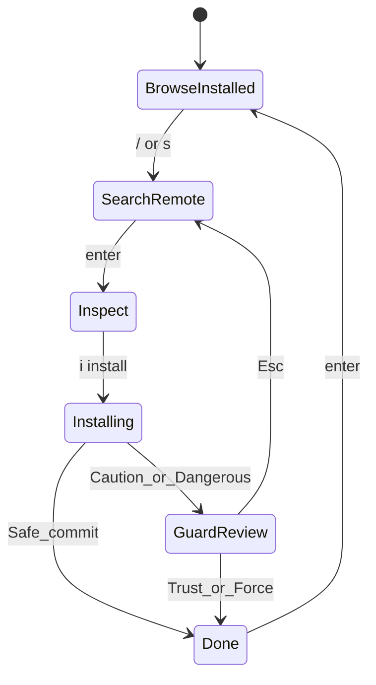

# 008 — TUI Expert Lens

**Cross-ref:** [002](./002-first-principles.md) · [009](./009-ux-ui-designer-lens.md) · [`../002-tui-hemes-vs-edgecrab/`](../002-tui-hemes-vs-edgecrab/)

## Verdict today

EdgeCrab’s **Skill Guard overlay** already exceeds Hermes Ink `skillsHub.tsx` (which is category→list→install with no findings pane). The gap is **productization**: one marketplace state machine with live install stages, shared chrome, and tests — not a third ad-hoc browser in `app.rs`.

## Target overlay: Skills Marketplace

Extract / unify into `edgecrab-cli/src/app/skills_marketplace.rs` (new) + keep `skill_trust_overlay.rs` as the gate stage renderer.

```text
  States:
    BrowseInstalled
    SearchRemote { query, results, source_filter, cursor }
    Inspect { identifier, preview_scroll }  # dossier: SKILL.md-first (see 016)
    Installing { stage, id }          # Fetch → Quarantine → Scan → Gate → Commit
    GuardReview { InstallScanPreview } # existing Skill Trust overlay
    Done { name } | Error { message }
```



## Keybindings (target — document in footer)

| Key | Context | Action |
|-----|---------|--------|
| `↑`/`↓` / `j`/`k` | lists | Move |
| `/` or `s` | installed | Focus search |
| `Enter` | result | Inspect dossier ([016](./016-inspect-capability-ux.md)) |
| `i` | inspect | Start install (Confirm if Safe) |
| `e` | inspect | Full Guard evidence (review-only) |
| `f` | guard (Caution) | Force install |
| `t` | guard (Dangerous) | Trust + install |
| `Tab` | guard | Cycle panes (findings / files / actions) |
| `Esc` | any | Back / cancel |
| `r` | search | Refresh index |
| `?` | any | Key help strip |

Match existing trust overlay actions via `skill_trust_action_labels` — do not invent a second label set.

## Chrome DRY

Reuse:

| Helper | Path |
|--------|------|
| Overlay layout | `overlay_layout.rs` |
| Browser chrome | `app/browser_chrome.rs` |
| Picker marker | `picker_chrome.rs` |
| Verdict palette | `remote_skill_guard.rs` (`skill_trust_verdict_palette`) |
| Severity style | `skill_trust_severity_style` |

**Ban:** copying Block/Borders styling into a one-off marketplace theme that drifts from Skill Guard.

## Install theatre (TUI)

While `Installing`:

```text
  ┌ Skill Install · owner/repo/path ─────────────────┐
  │ ● Fetch          done                             │
  │ ● Quarantine     done                             │
  │ ▶ Scan           running…                         │
  │ ○ Gate                                            │
  │ ○ Commit                                          │
  └───────────────────────────────────────────────────┘
```

On gate → transition to existing Skill Guard overlay with `InstallScanPreview` (no re-scan if preview already held).

Progress events should come from façade callbacks / staged async steps — **not** parsing Rich-like strings.

## Architecture rules

1. **UI never calls GitHub/registry HTTP directly.**  
2. **UI never decides allow/deny** — only presents `InstallScanPreview` + user choice → `InstallGate`.  
3. Handlers currently in `app.rs` / `browser_selectors.rs` move toward marketplace module; leave thin dispatch in event loop.  
4. Gateway remains text slash — no ratatui dependency.

## Comparison: Hermes Ink hub

| Aspect | Hermes | EdgeCrab target |
|--------|--------|-----------------|
| List installed | Yes | Yes |
| Multi-source search UI | Weak in Ink | First-class |
| Scan findings | No | Yes (keep lead) |
| File inspector | No | Yes (keep lead) |
| Stage progress | No (RPC swallows) | Yes |
| Tests | Component-level | Pure keymap + render tests |

## Test harness

| Test | Asserts |
|------|---------|
| `map_marketplace_key` | state transitions |
| `skill_trust_action_*` | existing labels stable |
| Render smoke | verdict palette regions with fixture `InstallScanPreview` |
| No network | façade mocked |

Follow `stream_dispatch_harness` culture: pure functions, no live TUI.

## Performance / UX budgets

| Budget | Value |
|--------|-------|
| Overlay open | <16ms frame; no sync network on open |
| Search debounce | 150–250ms |
| Scan preview | async; show spinner stage |
| List virtualization | reuse browser windowing (`windowItems` analogue) |

## Anti-patterns

- Modal stacked on modal without Esc stack  
- Installing state that blocks entire app event loop (use async task + poll)  
- Different Esc semantics between search and guard  
- Emoji-heavy chrome that fights skin engine — prefer skin semantic colors
